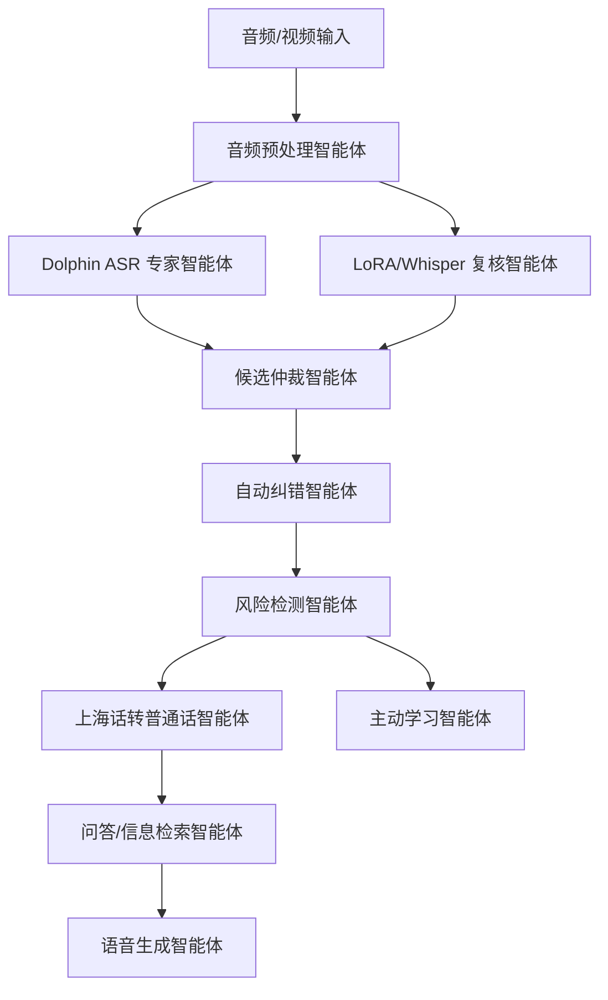
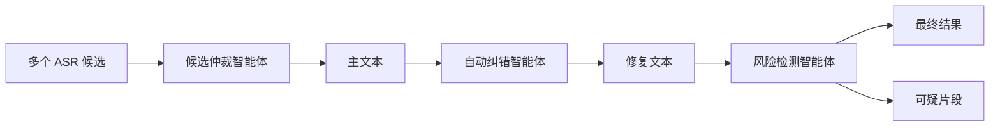

# 上海话多智能体 Agent：PPT 介绍讲稿

本文档用于课程展示和 PPT 制作，重点介绍本项目中每个智能体的职责、输入输出、关键机制和展示亮点。

## 1. 项目整体定位

本项目不是单纯调用一个语音识别模型，而是构建了一个面向上海话/吴语场景的多智能体协同系统。

系统目标是：

- 听懂上海话或带上海话特征的语音、视频；
- 将识别结果转换成普通话文本；
- 对不确定片段进行自动纠错和风险提示；
- 根据用户问题生成回答；
- 输出普通话或吴语风格的 MP3 语音回复；
- 通过主动学习机制持续收集难例，便于后续迭代。

整体流程：



## 2. 音频预处理智能体

### 职责

负责把用户上传的不同格式文件统一整理成适合 ASR 模型处理的音频。

### 输入

- WAV
- FLAC
- OGG
- MP3
- MP4 视频
- 长音频或长视频片段

### 输出

- 统一采样率的临时 WAV 音频；
- 适合后续模型处理的音频路径；
- 必要时进行分段或格式修复。

### 关键价值

很多识别失败并不是模型完全听不懂，而是音频容器、采样率、声道、编码格式不一致导致模型读取失败。预处理智能体把这些底层问题先消化掉，让后面的识别模型只关心语音内容。

### PPT 展示点

可以展示一句话：

> 预处理智能体解决的是“模型还没开始听，文件就已经读错了”的问题。

## 3. Dolphin ASR 专家智能体

### 职责

Dolphin 是当前系统中的主识别专家，负责第一轮上海话/吴语语音识别。

### 输入

- 预处理后的 16kHz WAV 音频；
- 上海地区提示；
- 上海话热词表。

### 输出

- 主识别文本；
- 作为后续纠错、翻译、问答的基础。

### 关键机制

系统调用 Dolphin 时加入了面向上海话的约束信息：

- 地区提示：`SHANGHAI`
- 语言提示：`zh`
- 热词增强：`侬好`、`阿拉`、`拧来`、`搿搭`、`勿`、`伐`、`辰光` 等；
- 深度偏置：让模型更倾向识别出上海话特征词；
- 两阶段过滤：减少明显异常输出。

### 为什么它是“专家”

普通中文 ASR 往往会把上海话强行识别成普通话近音词，例如：

- `侬好` 被识别成 `你好`；
- `拧来` 被识别成 `人来` 或其他近音；
- `阿拉` 被识别成 `啊啦`、`我们`；
- `伐` 被识别成 `吧`、`吗`。

Dolphin 专家智能体的优势是更适合方言识别，能保留更多吴语特征。

### PPT 展示点

可以把 Dolphin 讲成：

> 系统中的“主听力专家”，负责先把方言声音转换成尽可能可靠的文本。

## 4. LoRA/Whisper 复核智能体

### 职责

复核智能体提供第二意见。它不是用来直接替代 Dolphin，而是用来帮助判断 Dolphin 是否出现明显错误。

### 输入

- 同一段预处理音频；
- Dolphin 的主识别结果作为对照。

### 输出

- 复核候选文本；
- 供候选仲裁和自动纠错使用。

### 关键价值

Dolphin 对上海话更敏感，但在某些长视频、噪声、重复片段中也可能产生幻觉。复核智能体可以提供另一种视角：

- 如果两个模型都识别相似，说明结果更可信；
- 如果两个模型差异很大，说明该片段需要仲裁或标记风险；
- 如果 Dolphin 明显重复、乱码、空输出，复核结果可作为救援候选。

### PPT 展示点

> 复核智能体不是抢主模型的工作，而是给主模型配一个“审稿人”。

## 5. 候选仲裁智能体

### 职责

候选仲裁智能体负责在多个识别结果之间做决策：到底保留 Dolphin 主结果，还是采用复核候选。

### 输入

- Dolphin 主识别结果；
- LoRA/Whisper 复核结果；
- 每个结果的质量评分；
- 方言词保留情况；
- 是否出现异常信号。

### 输出

- 最终进入纠错流程的主文本；
- 候选采纳记录；
- 仲裁轨迹。

### 核心原则

候选仲裁不是简单投票，而是遵循一个偏向方言保护的原则：

> 默认相信 Dolphin，只有 Dolphin 明显坏掉时才替换。

这样做是因为复核模型虽然可能更接近普通话，但它也更容易把上海话词“普通话化”。如果随便替换，会丢掉方言信息。

### 判断 Dolphin 是否坏掉

系统主要检查以下异常：

- 识别为空；
- 出现乱码，例如 `�`；
- 出现长串重复幻觉；
- 文本极短但音频明显不短；
- 出现已知 ASR 混淆词；
- 字符多样性异常低；
- 输出明显不像自然句子。

### 示例

情况一：保留 Dolphin。

```text
Dolphin:
阿拉两个拧来聊聊金融方面呢

复核模型:
我们两个人来聊聊金融方面
```

这里 Dolphin 保留了 `阿拉`、`拧来` 等上海话特征，所以不会被复核结果直接覆盖。

情况二：允许复核候选替换。

```text
Dolphin:
阿拉阿拉阿拉阿拉阿拉阿拉阿拉...

复核模型:
阿拉两个拧来聊聊金融方面呢
```

这里 Dolphin 出现明显重复幻觉，仲裁智能体会考虑采用复核结果。

### PPT 展示点

候选仲裁可以讲成：

> 它不是选择“看起来更普通话”的结果，而是选择“在保留方言信息前提下更可信”的结果。

## 6. 自动纠错智能体

### 职责

自动纠错智能体负责在候选仲裁之后，对文本中的局部错误进行修复。

它不重新听音频，而是在已有识别文本和候选文本基础上做结构化后处理。

### 输入

- 仲裁后的主文本；
- 复核候选文本；
- 自定义纠错词表；
- 上下文规则；
- 方言词表和技术词表。

### 输出

- 修复后的识别文本；
- 修复记录；
- 被修复位置；
- 供风险检测使用的证据。

### 纠错层次一：固定错词修复

一些错误高度稳定，可以直接替换。

```text
罗拉 / 萝拉 -> LoRA
塞尔 / 西伊阿 -> CER
无语 / 五语 / 屋语 -> 吴语
微信 -> 微调
```

这类修复适合课程项目中的专业词、模型名和指标名。

### 纠错层次二：上下文修复

有些词不能无脑替换，需要结合上下文判断。

例如：

```text
先什么 / 先撒
```

如果附近出现：

```text
你好、侬好、初次见面、第一趟、上海
```

那么它很可能是：

```text
先生
```

因此系统可以修复为：

```text
先什么，你好 -> 先生，你好
```

### 纠错层次三：候选辅助修复

如果 Dolphin 和复核模型只在局部不同，系统会把复核结果作为证据。

```text
Dolphin:
先什么，你好

复核模型:
先生，你好
```

系统不会整段替换 Dolphin，而是只把 `先什么` 修为 `先生`。

### 纠错层次四：重复幻觉压缩

长音频中模型可能出现大量重复：

```text
那娘笔一个呢吸了吗我来嘛那娘笔一个呢吸了吗我来嘛...
```

系统会将明显重复压缩为：

```text
[重复片段省略]
```

这样可以避免最终展示结果被重复垃圾文本污染。

### 纠错层次五：方言到普通话替换

系统保留两套文本：

- 识别原文：尽量保留上海话特征；
- 普通话结果：面向普通用户阅读。

常见替换包括：

```text
阿拉 -> 我们
侬 -> 你
拧 -> 人
拧来 -> 人来
搿搭 -> 这里
勿 -> 不
伐 -> 吗
辰光 -> 时候
老早 -> 以前
```

### PPT 展示点

自动纠错智能体可以讲成：

> 它不是让 ASR 模型重新听一遍，而是像编辑一样修正常见错词、上下文错词和重复幻觉。

## 7. 风险检测智能体

### 职责

风险检测智能体负责告诉用户哪些地方虽然给出了结果，但系统并不完全确定。

这一步非常重要，因为语音识别模型经常会“自信地犯错”。风险检测智能体让系统不再假装完美。

### 输入

- 修复后的文本；
- 原始文本；
- 修复记录；
- 候选差异；
- 置信度和异常信号；
- 方言敏感词表。

### 输出

- 可疑片段列表；
- 风险等级；
- 风险原因；
- 给用户的复核提示。

### 风险类型一：低置信度

如果模型本身置信度低，或者多个候选结果差异很大，则标记为风险片段。

### 风险类型二：发生过自动修复

例如：

```text
先什么 -> 先生
```

即使修复后的结果看起来正确，也应该提示用户这里发生过系统推断。

### 风险类型三：方言敏感词

以下词对意思影响较大：

```text
拧
拧来
阿拉
侬
搿
勿
伐
```

这些词一旦错识别，普通话翻译也会跟着错。因此系统会将它们作为低风险或中风险复核点。

### 风险类型四：重复幻觉

如果同一片段反复出现，风险等级会升高。

例如：

```text
我来嘛我来嘛我来嘛我来嘛...
```

这通常不是说话人真实表达，而是模型解码异常。

### 风险类型五：乱码或异常符号

例如：

```text
�
```

这种属于高风险，因为说明识别或文本解码已经异常。

### 风险类型六：技术词混淆

课程项目中常见技术词包括：

```text
LoRA
CER
WER
Whisper
Qwen
SenseVoice
```

如果这些词被音译或误识别，系统会提示复核。

### PPT 展示点

风险检测智能体可以讲成：

> 它让系统从“给一个答案”升级为“给一个带可信度说明的答案”。

## 8. 上海话转普通话智能体

### 职责

将识别原文中的上海话表达转换为普通话，让非上海话用户也能理解。

### 输入

- 修复后的上海话/吴语文本；
- 方言词典；
- 替换规则。

### 输出

- 普通话结果；
- 替换记录。

### 示例

```text
识别原文：
阿拉两个拧来聊聊金融方面呢

普通话结果：
我们两个人来聊聊金融方面呢
```

### PPT 展示点

> 这一层解决的是“听懂之后，让更多人看懂”的问题。

## 9. 问答/信息检索智能体

### 职责

当用户语音中包含问题时，系统可以根据识别出的普通话问题生成回答。

如果问题涉及实时信息，可以由 Codex 搜索网上资料，再生成答案。

### 输入

- 普通话问题文本；
- 必要时的网络搜索结果；
- 用户上下文。

### 输出

- 回答文本；
- 可继续交给语音生成智能体生成 MP3。

### 示例

用户用上海话问：

```text
搿个地方哪能去？
```

系统转换为：

```text
这个地方怎么去？
```

然后生成路线或解释型回答。

### PPT 展示点

> 这一步让系统从“翻译器”变成“能回答问题的方言助手”。

## 10. 语音生成智能体

### 职责

把系统生成的回答转成 MP3，可以输出普通话，也可以输出吴语风格语音。

### 输入

- 回答文本；
- 输出目标：普通话或吴语；
- TTS 后端选择；
- 参考音频和参考文本。

### 输出

- MP3 或 WAV 语音文件。

### 三种生成方式

第一种：普通话 TTS。

适合快速生成普通话回答，稳定、清晰，但没有上海话味道。

第二种：吴语文本改写 + 普通话 TTS。

会把文字改成类似上海话表达，例如：

```text
我们 -> 阿拉
你 -> 侬
这里 -> 搿搭
不 -> 勿
吗 -> 伐
```

但缺点是声音仍然像普通话，因为发音模型没有真正学上海话。

第三种：WenetSpeech-Wu CosyVoice2 吴语生成专家，并由回识与风险智能体闭环验收。

使用训练集中的上海话说话人参考音频，让模型根据参考音色生成吴语风格语音。

### 当前关键认识

真正的“吴语味道”不是只靠改文字，而是需要语音模型学会：

- 上海话声母韵母；
- 方言声调；
- 说话节奏；
- 语气和停顿；
- 参考说话人的音色。

### PPT 展示点

> 文本改写决定“说什么像上海话”，TTS 模型决定“听起来像不像上海话”。

## 11. 主动学习智能体

### 职责

主动学习智能体负责收集系统最不确定、最容易出错的片段，为下一轮改进提供训练材料。

### 输入

- 高风险片段；
- 候选差异大的片段；
- 自动纠错过的片段；
- 用户反馈。

### 输出

- 难例样本；
- 后续可加入训练集或规则库。

### 触发条件

常见触发原因包括：

- 高风险可疑片段；
- ASR 候选分歧明显；
- 候选仲裁采用了替代结果；
- 发生了自动纠错；
- 用户手动指出识别错误。

### PPT 展示点

> 主动学习智能体让系统不是一次性完成，而是能持续从错误中学习。

## 12. 三个核心智能体之间的关系

候选仲裁、自动纠错、风险检测是系统质量控制的核心。



它们的区别：

| 智能体 | 核心问题 | 主要动作 |
|---|---|---|
| 候选仲裁智能体 | 多个识别结果该信谁？ | 选择或保留候选 |
| 自动纠错智能体 | 文本里哪些错能修？ | 替换、修复、压缩 |
| 风险检测智能体 | 哪些地方仍不可靠？ | 标记风险、提示复核 |

一句话总结：

> 候选仲裁负责选路，自动纠错负责修路，风险检测负责提示哪里路况不好。

## 13. 课程展示建议

PPT 可以按以下顺序讲：

1. 项目背景：上海话语音识别难，普通 ASR 容易普通话化。
2. 整体架构：不是单模型，而是多智能体协作。
3. Dolphin 专家：负责主识别。
4. 复核智能体：提供第二意见。
5. 候选仲裁：避免错误替换，保护方言信息。
6. 自动纠错：修正常见错词、上下文错词、重复幻觉。
7. 风险检测：标出不可靠片段。
8. 普通话翻译：让非上海话用户看懂。
9. 问答智能体：从翻译器升级为方言助手。
10. 语音生成：支持普通话和吴语风格 MP3。
11. 主动学习：持续收集难例，支持后续迭代。
12. 总结创新点：专家模型 + 多智能体协作 + 风险可解释 + 语音闭环。

## 14. 项目创新点总结

本项目的创新点可以概括为：

- 不是只做 ASR，而是做完整的方言理解 agent；
- 引入 Dolphin 作为上海话识别专家；
- 使用复核模型进行多候选协作；
- 通过候选仲裁保护方言信息；
- 通过自动纠错修复稳定错误；
- 通过风险检测提高结果可信度；
- 支持普通话翻译和语音回答；
- 支持吴语风格 MP3 输出；
- 通过主动学习机制为后续训练积累难例。

最终系统可以被描述为：

> 一个面向上海话语音理解的多智能体协同系统，能够完成识别、纠错、风险提示、翻译、问答和语音回复的完整闭环。
