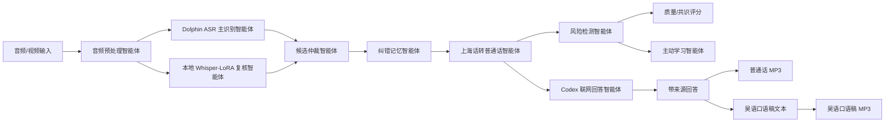

# 上海话/吴语多智能体语音理解 Agent 项目说明

## 1. 项目缘由

本项目最初来自一个很直接的问题：普通自动语音识别系统在处理上海话、吴语口语和普通话混说时，经常会把方言词误听成普通话词，或者在长视频、背景声、人名地名、课程术语里产生明显错误。比如“侬好”“阿拉”“哪能”“辰光”“搿个”“拧来”等词，本身在上海话语境里很自然，但通用模型容易把它们普通话化，或者识别成语义不通的近音词。

课程作业的主题是“大语言模型与多智能体协同”。因此，这个项目没有只做一个单模型 ASR，也没有把外部强模型简单包装成网页工具，而是把它设计成一个可解释的多智能体系统：不同智能体分别负责识别、复核、仲裁、纠错、翻译、风险检测、主动学习、联网问答和语音输出。这样做的目的不是声称某一个模型永远正确，而是在低资源方言任务里尽量降低错误、暴露不确定性，并让系统能够持续迭代。

项目经历了几次关键转向：

- 第一阶段：检查原始 agent 完整性，修复音频读取、示例数据、网页运行和基础 ASR 流程。
- 第二阶段：不用小样本演示，改为使用公开上海话会话语音数据，按 3700 条训练、92 条验证做正式训练。
- 第三阶段：发现本地 Whisper-LoRA 对短句、长视频和干净长片段仍不稳定，于是引入 Dolphin 中文方言 ASR 作为强识别底座。
- 第四阶段：保留本项目自己的价值，不把系统完全变成“别人的模型”，而是把 Dolphin、本地 LoRA、词典、候选仲裁、风险检测和主动学习组织成多智能体协作层。
- 第五阶段：扩展到 Codex-native agent：如果用户用上海话提出现实问题，系统先识别问题，再由 Codex 当前会话联网搜索并回答，不需要 OpenAI API key。
- 第六阶段：增加普通话 MP3 和吴语口语稿 MP3 输出，面向不方便阅读文字的老人或真实服务场景。

这个项目的核心定位是：面向上海话/吴语的“语音理解 + 纠错 + 普通话转换 + 问答 + 语音回复”多智能体系统。

## 2. 数据与训练设置

项目使用公开数据集：

```text
TingChen-ppmc/Shanghai_Dialect_Conversational_Speech_Corpus
```

当前数据划分：

- 全量音频：3792 条
- 训练集：3700 条，`data/splits/train.jsonl`
- 验证集：92 条，`data/splits/dev.jsonl`
- 自训练模型：`outputs/models/whisper-small-shanghai-lora-full`
- 本地 LoRA 验证结果：92 条验证集 beam=5 Corpus CER 约为 `0.1107`

训练集文本体现了真实上海话口语书写习惯，例如：

- `阿拉` 表示“我们”
- `侬` 表示“你”
- `吾` 表示“我”
- `哪能` 表示“怎么”
- `辰光` 表示“时候”
- `搿个 / 迭个` 表示“这个”
- `侪` 表示“都”
- `勿 / 勿要` 表示“不 / 不要”
- `落脱` 表示“丢失 / 掉了”

这些词不是简单的普通话替换，而是系统在识别、转写、翻译和吴语口语稿生成中需要保留或正确转换的核心语言特征。

## 3. 总体框架

项目当前默认后端是：

```text
dolphin_multiagent
```

也就是 Dolphin 主识别 + 本地 Whisper-LoRA 复核 + 多智能体协作层。

整体流程如下：



这个框架体现了两个原则：

1. 强模型负责强识别，但系统不盲信强模型。
2. 自研部分负责协作、纠错、解释、风险控制和持续学习。

## 4. 多智能体分工

### 4.1 音频预处理智能体

负责接收用户上传的音频或视频文件，并转成统一格式。当前支持：

- WAV
- FLAC
- OGG
- M4A
- MP3
- MP4
- AAC

如果文件后缀和真实封装不一致，例如用户把 M4A 改名为 FLAC，系统会尽量用 ffmpeg 或备用音频库兜底解码。

对于长视频或长音频，系统会按停顿做切分，默认最长 8 秒一个语音区间；没有稳定停顿时才回退到固定切片。这是为了解决长视频中常见的重复幻觉和上下文漂移问题。

### 4.2 Dolphin ASR 主识别智能体

Dolphin 是当前默认主识别模型，负责中文方言 ASR。它对上海话短句和中文方言口语整体更稳，因此被放在主识别位置。

项目没有直接把 Dolphin 当成唯一答案，而是给它加上：

- 上海地区提示
- deep-biasing 热词
- 常见上海话词表
- 本地 LoRA 复核
- 后处理纠错
- 风险检测

常见热词包括：

```text
先生、侬好、初次见面、第一趟、阿拉、拧来、哪能、辰光
```

### 4.3 本地 Whisper-LoRA 复核智能体

本地模型来自 3700 条训练集 LoRA 微调。它不是当前最强主识别器，但它保留了项目自己的训练成果，并作为第二视角参与复核。

它主要用于：

- 给 Dolphin 主输出提供候选对照
- 发现候选分歧
- 在 Dolphin 明显失败时兜底
- 给主动学习队列提供再训练样本

例如在某些样本中，Dolphin 输出较稳定，本地 LoRA 候选有明显误差，系统会保留 Dolphin 主输出；但这类分歧会被记录到主动学习队列，供后续人工确认和再训练使用。

### 4.4 候选仲裁智能体

候选仲裁智能体比较主输出和复核候选。它不会轻易覆盖主识别结果，只有在以下情况才可能切换或标记风险：

- 主输出为空或极短
- 主输出包含乱码或替换字符
- 长文本出现重复幻觉
- 已知短句混淆
- 多候选差异很大且主输出低可信

这种设计避免系统频繁“自作聪明”改掉正确结果，同时也能在明显异常时保护最终输出。

### 4.5 纠错记忆智能体

纠错记忆智能体负责应用词典、上下文规则和用户长期纠错记录。

当前词典包括：

- 上海话到普通话转换规则
- 方言词表
- 需要复核的方言残留词
- ASR 常见错词修复
- 上下文纠错规则
- 课程术语表

例如：

```text
哪能 -> 怎么
辰光 -> 时候
侬好伐 -> 你好吗
阿拉 -> 我们
吾听勿大清爽 -> 我听不太清楚
罗拉 -> LoRA
塞尔 -> CER
```

用户还可以通过 `data/user_corrections.json` 保存长期纠错，例如人名、地名、课程专有词和视频专属词。

### 4.6 上海话转普通话智能体

这个智能体把识别原文转换成普通话结果。它不是单纯删除方言词，而是尽量保留语义：

```text
民警同志我的身份证刚刚落脱乃哪能办
-> 民警同志我的身份证刚刚落脱乃怎么办
```

这里 `哪能` 被转换成 `怎么`，但 `落脱` 这类词如果语境明确，也可以保留或在回答阶段解释为“丢了”。

### 4.7 风险检测智能体

风险检测智能体负责判断结果是否可以直接使用。它会输出：

- 识别状态
- 可疑片段数量
- 修复次数
- 质量评分
- 候选共识评分
- 失败原因
- 下一步建议

状态包括：

- `可直接使用`
- `可用但需留意`
- `无法可靠识别`

如果识别结果包含高风险片段，系统不会硬输出一个看似完整的答案，而是提示用户换更短、更清晰片段，或者把草稿放在“高风险草稿”里。

### 4.8 主动学习智能体

主动学习智能体把系统不确定、候选分歧或经过修复的样本沉淀下来，写入：

```text
data/active_learning_queue.jsonl
```

这些样本不会直接进入训练集，而是需要人工确认后再导出下一轮训练 manifest。这样可以避免把错误答案直接喂回模型。

主动学习样本常见来源：

- ASR 候选分歧
- 术语修复
- 高风险识别片段
- 人工纠错样本
- 长视频重复幻觉片段

### 4.9 Codex 联网回答智能体

联网回答没有做成网页功能，也不依赖 OpenAI API key。它是 Codex-native 流程：

1. 先调用本项目 agent 识别上海话问题。
2. 生成 `outputs/codex_question_task.md`。
3. Codex 当前会话读取任务文件。
4. Codex 判断识别是否可靠。
5. 如果问题涉及实时信息、政策、热线、新闻、价格或地点，Codex 联网搜索。
6. Codex 输出带来源的中文回答。
7. 系统把回答转成普通话 MP3 和吴语口语稿 MP3。

示例：

```powershell
.\.venv\Scripts\python.exe -m ganagent.cli translate --audio outputs\help_57_64.wav --codex-task-output outputs\help_57_64_codex_task.md --no-save-active-learning
```

这样做的好处是：联网搜索本身由 Codex 承担，不需要在项目里硬编码 API，也不需要把回答模型塞进 Streamlit。

### 4.10 语音输出智能体

语音输出智能体负责把最终答案生成 MP3。当前支持：

- 普通话答案 MP3
- 训练集风格吴语口语稿文本
- 吴语口语稿 MP3

命令示例：

```powershell
.\.venv\Scripts\python.exe -m ganagent.cli speak --text-file outputs\codex_answer.txt --output outputs\codex_answer.mp3 --wu-output outputs\codex_answer_wu.mp3 --wu-text-output outputs\codex_answer_wu.txt
```

需要特别说明：当前 edge-tts 本机可用音色中没有真正的 `wuu-CN` 或上海话音色。因此，系统会按训练集风格生成吴语文本，但 MP3 仍可能是普通话音色朗读。项目已经在 CLI 和网页中加入提示，避免把“吴语口语稿 + 普通话音色”误称为真正吴语发音。

## 5. 已实现功能

### 5.1 上海话/吴语音频识别

系统可以上传或指定音频/视频文件，输出：

- 识别原文
- 普通话结果
- 分段信息
- 多智能体协作记录
- 开源候选识别
- 修复记录
- 可疑片段
- 主动学习候选

### 5.2 多后端切换

当前支持：

- `dolphin_multiagent`
- `hybrid`
- `dolphin`
- `whisper`
- `funasr`
- `mock`

其中默认推荐 `dolphin_multiagent`。

### 5.3 长视频切分

系统可以处理较长视频，并使用停顿切分降低长音频识别错误。对于干净长片段，系统不再简单整段扔给 Whisper，而是尽量切成适合 ASR 的短语音片段。

### 5.4 方言词典与上下文纠错

系统内置上海话词典和课程术语表，同时支持用户新增纠错：

```text
错词=正确词
```

或写入：

```text
data/user_corrections.json
```

### 5.5 质量评分与风险提示

每次识别会输出：

- `quality_score`
- `consensus_score`
- `suspicion_count`
- `repair_count`
- `action_suggestion`

这让系统不只是输出文本，还能解释“为什么这个结果可信或不可信”。

### 5.6 Codex 问答任务生成

如果识别内容是问题，可以生成 Codex 任务包：

```text
outputs/codex_question_task.md
```

任务包包含：

- 用户问题候选
- 识别原文
- 识别质量
- 可疑片段
- 协作智能体记录
- 其他识别候选
- 主动学习候选
- Codex 执行要求

### 5.7 联网回答与来源引用

Codex 读取任务包后，可以搜索官方来源或可靠网页，并生成回答。例如：

- 身份证丢了怎么办
- 上海有哪些常用求助电话
- 某个政策或地点信息

回答会保留来源链接，便于答辩展示系统不是凭空生成答案。

### 5.8 普通话与吴语口语稿 MP3

系统可以把回答转换成：

- 普通话 MP3
- 吴语口语稿文本
- 吴语口语稿 MP3

这使项目从“识别工具”扩展成“可服务真实用户的语音问答助手”。

## 6. 示例任务

### 6.1 12-17 秒：身份证丢失

用户音频问题识别结果：

```text
民警同志我的身份证刚刚落脱乃哪能办
```

普通话结果：

```text
民警同志我的身份证刚刚落脱乃怎么办
```

系统回答核心：

```text
身份证丢失后尽快到就近公安派出所综合窗口申报挂失并申请补领；在上海也可通过随申办或一网通办办理符合条件的网上补领。
```

输出：

- 普通话回答文本
- 普通话 MP3
- 吴语口语稿
- 吴语口语稿 MP3

### 6.2 57-64 秒：重要求助电话号码

识别原文：

```text
请问那上海有几个重要的求助电话号码平常辰光要记牢的
```

普通话结果：

```text
请问那上海有几个重要的求助电话号码平常时候要记牢的
```

回答核心：

```text
110 报警，119 火警/消防救援，120 医疗急救，122 交通事故报警，12345 上海市民服务热线。
```

训练集风格吴语口语稿示例：

```text
辣海上海，顶顶要紧、平常辰光最好记牢个求助电话号码有迭几个：110 是报警电话，碰着治安、刑事案件或者紧急危险个辰光打；119 是火警搭消防救援电话；120 是医疗急救电话；122 是交通事故报警电话；12345 是上海市民服务热线。
```

## 7. 项目文件结构

关键目录与文件：

```text
app/streamlit_app.py                 Streamlit 页面入口
src/ganagent/agent.py                agent 主流程
src/ganagent/asr_backends.py         ASR 后端和多模型协作
src/ganagent/repair.py               词典、规则和纠错记忆
src/ganagent/product.py              最终产品化输出和质量评分
src/ganagent/learning.py             主动学习队列
src/ganagent/codex_task.py           Codex 联网问答任务包
src/ganagent/tts.py                  普通话/吴语口语稿 MP3
src/ganagent/cli.py                  命令行入口
data/splits/train.jsonl              3700 条训练集
data/splits/dev.jsonl                92 条验证集
data/examples/shanghainese_glossary.json  上海话词典
data/user_corrections.json           用户长期纠错记忆
outputs/models/whisper-small-shanghai-lora-full  本地 LoRA 模型
AGENTS.md                            Codex-native agent 工作流说明
```

## 8. 使用方式

### 8.1 启动网页

```text
START_UI.bat
```

浏览器访问：

```text
http://localhost:8501
```

网页适合演示：

- 上传音频/视频
- 查看普通话结果
- 查看识别原文
- 查看修复记录
- 查看可疑片段
- 查看多智能体协作记录
- 生成普通话或吴语口语稿 MP3

### 8.2 命令行识别

```powershell
.\.venv\Scripts\python.exe -m ganagent.cli translate --audio path\to\audio.wav --json
```

### 8.3 生成 Codex 问答任务

```powershell
.\.venv\Scripts\python.exe -m ganagent.cli translate --audio path\to\question.wav --codex-task-output outputs\codex_question_task.md --no-save-active-learning
```

### 8.4 生成回答 MP3

```powershell
.\.venv\Scripts\python.exe -m ganagent.cli speak --text-file outputs\codex_answer.txt --output outputs\codex_answer.mp3 --wu-output outputs\codex_answer_wu.mp3 --wu-text-output outputs\codex_answer_wu.txt
```

### 8.5 查看主动学习队列

```powershell
.\.venv\Scripts\python.exe -m ganagent.cli learning --json
```

## 9. 当前局限

### 9.1 真实吴语 TTS 仍未完成

当前系统可以生成训练集风格吴语文本，但由于 edge-tts 没有可用的上海话音色，吴语 MP3 仍可能是普通话音色朗读。真正自然的上海话语音回复需要接入：

- 真实 wuu-CN / 上海话 TTS
- 基于训练集的方言 TTS
- voice cloning
- 语音转换模型

### 9.2 上海话书写不统一

上海话没有完全统一的书写规范。同一个词可能有多种写法，例如：

- `搿个` / `迭个`
- `伐` / `勿`
- `辣海` / `辣`
- `呃` / `个`

这会影响识别评估、词典规则和吴语口语稿生成。

### 9.3 本地 LoRA 仍不够强

3700 条训练数据已经比小样本演示更正式，但对于开放域长视频、嘈杂音频和复杂口音仍然不足。本地模型更适合作为复核候选和主动学习来源，而不是单独承担最终识别。

### 9.4 Dolphin 也不是万能

Dolphin 对中文方言识别更强，但在特定人名、地名、专业词和长上下文里仍可能出错。因此系统保留了候选仲裁、纠错记忆和风险检测。

### 9.5 联网回答依赖 Codex 当前会话

为了不要求 API key，联网搜索由 Codex 当前会话完成。这适合课程展示和 Codex-native agent，但如果要部署给普通用户独立运行，需要另接搜索 API 或本地知识库。

## 10. 未来改进方向

### 10.1 接入真正上海话/吴语 TTS

这是最优先的改进之一。方向包括：

- 寻找公开上海话 TTS 模型
- 基于训练集或额外语音数据训练小型 TTS
- 使用 voice cloning 技术做上海话音色
- 将吴语口语稿作为输入，生成真正上海话发音

完成后，系统就不只是“吴语文本 + 普通话音色”，而是可以给老人听到更自然的上海话回复。

### 10.2 增强吴语生成模块

当前吴语口语稿主要依靠规则和训练集风格词表。未来可以改进为：

- 检索训练集中相似句式
- 用 few-shot 示例生成更自然吴语回复
- 建立普通话到上海话的平行短语库
- 增加语序和语气词规则
- 对不同说话风格做适配

### 10.3 做 segment 级对齐与可视化

当前系统主要展示整段识别结果。未来可以实现：

- 每个语音片段的时间戳
- Dolphin 与 LoRA 逐片段对齐
- 哪些片段被修复
- 哪些片段低置信
- 哪些片段进入主动学习队列

这会让答辩展示更直观。

### 10.4 建立人工确认页面

主动学习队列目前已经能记录样本，但人工确认仍偏命令行。未来可以做一个网页端表单：

- 显示音频片段
- 显示主识别和候选识别
- 让用户填写正确转写
- 标记是否进入训练集
- 一键导出下一轮训练 manifest

### 10.5 增强领域知识与公共服务场景

当前已经演示了身份证丢失、求助电话等公共服务问答。未来可以扩展：

- 派出所办事
- 医疗挂号
- 社区服务
- 交通出行
- 老年人常见生活咨询
- 政务热线

这样项目会从课程 demo 更接近真实服务 agent。

### 10.6 多模型投票与动态路由

未来可以把 Dolphin、Whisper-LoRA、FunASR、SenseVoice、Whisper-Wu 等候选模型纳入统一路由：

- 短句用 Dolphin
- 长音频先 VAD 切分
- 术语多时启用热词
- 候选差异大时触发复核
- 高风险时要求人工确认

这会让系统更稳，也更符合多智能体协作主题。

### 10.7 建立可量化评测报告

可以继续完善：

- 92 条验证集多后端对比
- CER / WER
- 方言词召回
- 术语召回
- 高风险拦截率
- 候选分歧发现率
- 主动学习样本转化率
- 长视频重复幻觉压缩效果

这些指标可以直接放入课程答辩。

## 11. 项目价值总结

这个项目的价值不只在于“能识别上海话”，而在于把一个低资源方言任务做成了可解释、可迭代、可演示的多智能体系统。

它的特点是：

- 使用真实公开数据训练，不是小样本玩具 demo。
- 引入强方言 ASR，但保留自研模型作为复核与主动学习来源。
- 不是黑箱输出，而是展示多智能体协作过程。
- 有质量评分、可疑片段和下一步建议。
- 能把错误样本沉淀到主动学习队列。
- 能处理用户真实问题，并由 Codex 联网搜索回答。
- 能输出普通话 MP3 和训练集风格吴语口语稿。

如果后续补上真正上海话 TTS 和人工确认闭环，这个项目可以进一步升级成面向老年人、社区服务和方言保护的实用型语音问答 agent。
