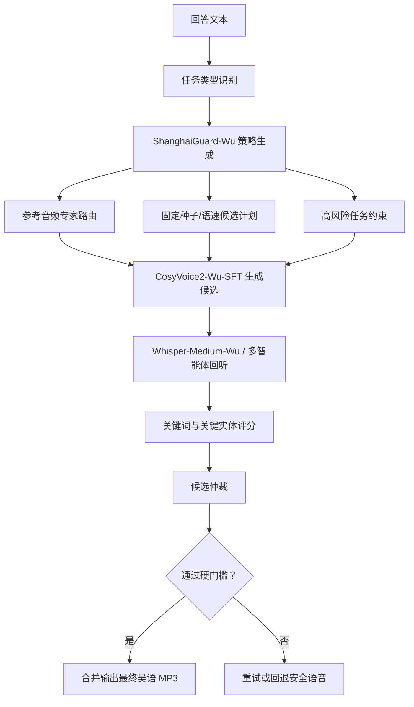

# ShanghaiGuard-Wu 吴语生成专家控制层

## 定位

最终的吴语 MP3 不是简单调用一个公开 TTS 模型。项目把公开的 WenetSpeech-Wu `CosyVoice2-Wu-SFT` 作为声学底座，在它上面实现了自己的 `ShanghaiGuard-Wu` 生成专家控制层。

换句话说：

- 开源底座负责“能不能发出吴语/上海话声学特征”；
- `ShanghaiGuard-Wu` 负责“生成哪一个候选、是否可信、是否能发布、哪里必须重试”。

这个设计更符合多智能体课程作业：底层专家模型提供能力，项目自己的智能体负责协作、约束、评估和仲裁。

## 代码位置

- 核心策略：`src/ganagent/wu_generation_expert.py`
- 命令行接入：`src/ganagent/cli.py` 的 `speak-verified`
- 参考专家库：`configs/wu_reference_experts.json`
- 语音质量评分：`src/ganagent/speech_quality.py`
- 吴语 TTS 接口与裁剪工具：`src/ganagent/tts.py`
- 自动测试：`tests/test_agent.py`

## 架构

## 1. 任务类型识别

`classify_wu_generation_task()` 会把回答分成三类：

| 类型 | 触发条件 | 策略 |
| --- | --- | --- |
| `hotline` | 包含 `110`、`119`、`120`、`12345`、报警、火警、热线、电话等 | 最高风险，禁用句首裁剪，只允许热线认证参考 |
| `public_service` | 包含身份证、派出所、户籍、居住证、社区等 | 允许多参考专家竞争，保留关键实体硬门槛 |
| `general` | 普通日常回答 | 允许多候选、多参考、句首赘词裁剪 |

这样做的原因是：吴语 TTS 偶尔会在句首多生成赘词，普通寒暄可以裁剪，但电话号码、报警电话这类内容不能冒险裁剪。

## 2. 参考音频专家路由

系统不是固定使用一个参考音频，而是把参考音频看成“专家”：

- 每个专家有 `expert_id`、性别、领域、质量分和提示文本；
- 普通政务问题可以在男声、女声、政务参考之间竞争；
- 热线类任务只允许带 `hotline` 领域标签的认证参考；
- 如果未来加入更高质量的真实上海话说话人参考，只需要更新配置，不必重写主流程。

这部分的价值是让声学模型保持开源底座不变，但项目自己控制“用什么说话人风格来生成”。

## 3. 确定性候选计划

`build_wu_generation_policy()` 会生成一组可复现的候选：

- 固定种子：`1986, 2026, 3407, 42, 8675309`
- 固定语速：`0.94, 0.88, 1.0, 0.82, 0.9`
- 优先保留前两个基线候选，避免只试一次就发布；
- 普通任务会继续探索其他参考专家；
- 可选接入第二个兼容 TTS 服务，用作候选专家，而不是直接替换主模型。

这使每次生成都能复现，方便评估和答辩展示。

## 4. 句首赘词裁剪策略

公开 Wu-SFT 有时会在句首多说一两个字。项目实现了保守裁剪：

1. 先生成原始候选；
2. 用 ASR 回听；
3. 判断识别文本是否在句首出现明显额外片段；
4. 裁剪后再次回听；
5. 只有裁剪版关键实体不丢、关键词召回不下降、字符准确率提升，才采用裁剪版。

热线和电话号码任务自动禁用这一步，因为这些任务宁可保守，也不能把数字或前置语义剪掉。

## 5. 关键实体硬门槛

候选不是只看“听起来像不像”，还要看关键实体是否完整：

- 电话号码必须整串保留；
- 身份证、派出所、户籍等服务实体必须出现；
- `812345` 不能误判成 `12345`；
- 任一关键实体缺失，候选就不能直接发布。

这部分让吴语生成从“好听”转向“可用”。

## 6. 候选仲裁

最终候选按照以下顺序排序：

1. 是否通过关键实体硬门槛；
2. 关键实体召回；
3. 关键词召回；
4. 字符准确率；
5. 方言信号分；
6. 可疑片段数量越少越好。

这相当于一个“生成后验收智能体”：TTS 模型负责说，仲裁智能体负责判断这句话能不能交给用户。

## 7. 报告可解释性

每次 `speak-verified` 生成都会把策略写进 `verification_report.json`：

- `wu_generation_expert`: `ShanghaiGuard-Wu`
- `wu_generation_policy.task_type`
- `wu_generation_policy.reference_experts`
- `wu_generation_policy.schedule`
- 每个候选的 seed、speed、reference expert、回听文本和质量分

所以答辩时可以直接展示：系统不是黑盒生成，而是每个候选为什么被选、为什么被拒绝都有记录。

## 和开源模型的关系

诚实表述应该是：

> 本项目没有重新训练 CosyVoice2-Wu 的底层大模型权重，而是在公开 WenetSpeech-Wu 吴语生成专家上，设计并实现了 `ShanghaiGuard-Wu` 多智能体生成控制层，包括任务风险识别、参考专家路由、候选生成计划、回听自验证、关键实体硬门槛、句首赘词裁剪和最终仲裁。

这既保留了开源专家模型的优势，也体现了课程项目自己的工程和算法设计。
