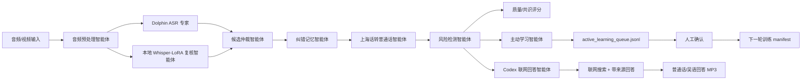

# V2 迭代说明：多智能体方言语音理解系统

## 核心定位

本项目从“上海话 ASR 修复工具”升级为“Dolphin 强识别底座 + 自研多智能体协作层”的方言语音理解系统。

Dolphin 负责提供更强的中文方言识别能力；本项目自己的贡献集中在协作、可解释、风险控制和持续学习：

- 不是只调用单一模型，而是把 Dolphin、本地 LoRA、词典规则、风险检测和主动学习组织成可解释的 agent workflow。
- 不只输出一段文本，还输出协作记录、候选分歧、质量评分、下一步建议和可再训练样本。
- 不把模型错误直接喂回训练集，而是通过人工确认字段导出下一轮训练 manifest。

## 系统架构



## V2 新增功能

- 默认后端：`dolphin_multiagent`
- 新增质量评分：`quality_score`
- 新增候选共识评分：`consensus_score`
- 新增下一步建议：`action_suggestion`
- 新增主动学习队列读取、汇总、报告和导出功能
- 新增 Streamlit 主动学习队列概览
- 新增 MP3 语音输出：普通话结果和吴语口语稿，服务不方便阅读文字的老人
- 新增 Codex 联网回答智能体：当用户说的是问题时，先生成 Codex 任务包，再由 Codex 当前会话联网检索并生成带来源回答
- 增强 Markdown 报告：加入质量评估、多智能体轨迹、候选识别和主动学习候选
- 增强批处理 dashboard：加入平均修复数、平均可疑片段、主动学习数量和待复核数量

## 主动学习闭环

队列文件：

```text
data/active_learning_queue.jsonl
```

查看队列：

```powershell
python -m ganagent.cli learning --json
```

生成报告：

```powershell
python -m ganagent.cli learning --report outputs\active_learning_report.md
```

导出人工确认样本：

```powershell
python -m ganagent.cli learning --export-manifest data\splits\active_learning_confirmed.jsonl
```

导出条件：

- 队列项 `status` 为 `confirmed` 或 `approved`
- 队列项包含 `confirmed_transcript`、`confirmed_text`、`reference` 或 `text`

## 答辩展示路径

1. 展示默认 `dolphin_multiagent` 后端。
2. 上传短音频，展示普通话结果、识别原文、质量评分和下一步建议。
3. 展开“多智能体协作记录”，解释每个智能体的职责。
4. 展开“开源候选识别”，说明 Dolphin 和本地 LoRA 的分工。
5. 展开“主动学习候选”，说明系统如何把错误样本沉淀到下一轮迭代。
6. 运行 `python -m ganagent.cli learning --json`，展示队列统计。
7. 勾选“生成语音 MP3”，展示普通话或吴语口语稿可以直接播放和下载。
8. 运行 `translate --codex-task-output outputs\codex_question_task.md`，展示 Codex 如何读取任务包、联网搜索、回答并生成普通话/吴语回答 MP3。

## 可以继续迭代的 V3

- 给主动学习队列加网页端人工确认表单。
- 增加 per-segment 时间戳级别的 Dolphin/LoRA 对齐。
- 增加人名、地名、课程术语的专用记忆库。
- 增加多个开源候选模型的投票策略。
- 增加 92 条验证集上的多后端对比报告。
